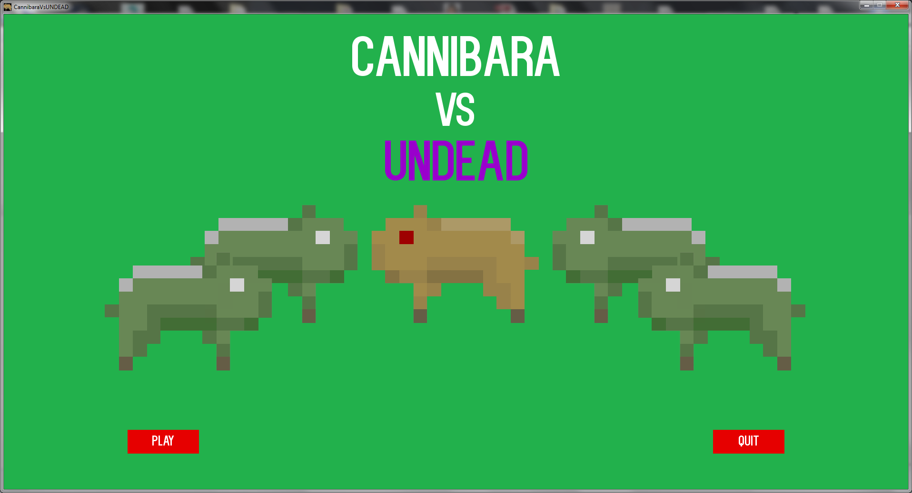
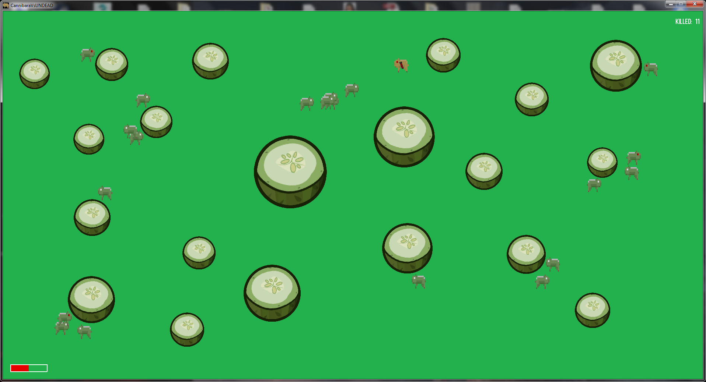

# Cannibara Vs Undead

 - pojedyncze zombie kapibary będą cię unikać
 - uważaj na zachowanie przeciwników, gdy zbiorą się w hordę atakują bez opamiętania
 - zabij jak najwięcej zombie kapibar
 
Sterowanie:

 - WSAD/strzałki - ruch, 'esc' - natychmiasowe zamknięcie aplikacji
 - kursor - kierunek strzału
 - lewy przycisk myszy - strzał
    
Projekt wykonany z wykorzystaniem Pythona 3.4 oraz PyGame 1.9.2a0 dla Pythona 3.4 w celu przetestowania algorytmów sterowania.

#
Katalog z plikami wykonywalnymi dostępny tutaj: 

https://my.pcloud.com/publink/show?code=XZmpDQ7ZdXnYVeNS7Of3oB4n5zcOGmXkQLUk

Instrukcja: wypakuj plik zip i uruchom cannibara.exe 

#
 - single zombie capybaras will avoid you
 - watch out for the opponents' behavior, when they gather in a horde they gonna  attack without any hesitation
 - kill as many zombie capybaras as possible
 
 Controls:
 
 - WSAD / arrows - movement, 'esc' - immediate closure of the application
 - cursor - direction of the shot
 - left mouse button - a shot
 
Project made using Python 3.4 and PyGame 1.9.2a0 for Python 3.4 to test steering behaviours.

Catalog with executable files available here:

https://my.pcloud.com/publink/show?code=XZmpDQ7ZdXnYVeNS7Of3oB4n5zcOGmXkQLUk

Instructions: extract the zip file and run cannibara.exe

